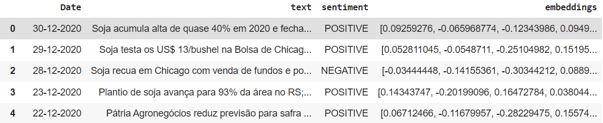
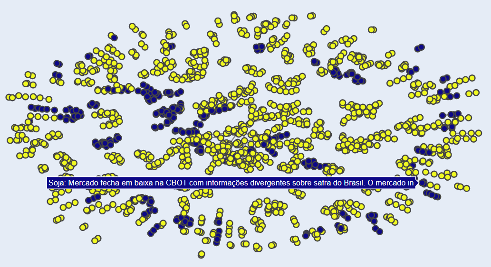
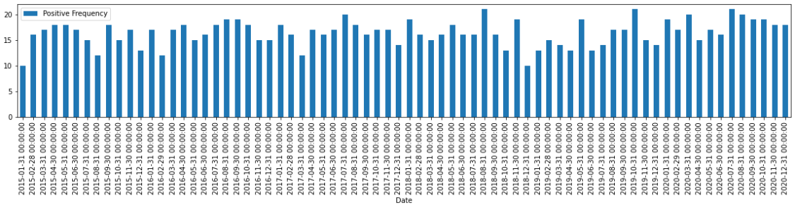
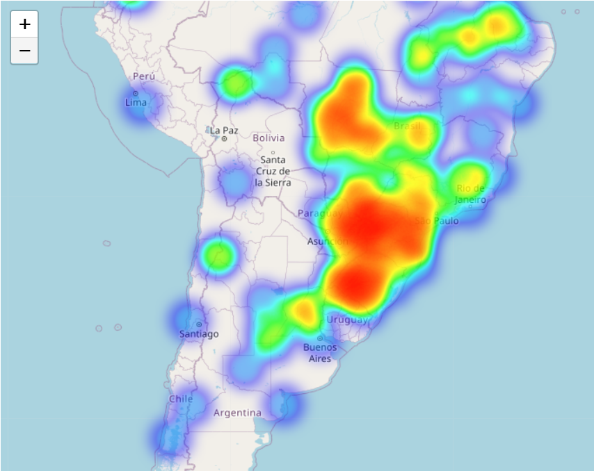

# AgroBERT: BERT-based text pre-processing for the agribusiness domain

AgroBERT is a neural model language for pre-processing agribusiness texts, considering opinion words about commodities. The model was trained for multilingual applications, allowing the analysis of texts in English and Portuguese.

AgroBERT has two main features:

* Generation of multilingual embeddings for texts in the agribusiness domain
* Extraction of sentiment labels (positive or negative) considering opinion words

AgroBERT has been applied in exploratory analysis tasks of the Websensors project. It was developed with funding and resources from [CNPq](https://cnpq.br/)  and with support from [C4AI](https://c4ai.inova.usp.br/).

# AgroBERT usage
## Pre-processing and classification of agribusiness texts

## Analysis of the temporal evolution of negative or positive texts about a certain commodity.

## Analysis of the geographic coverage of negative or positive texts about a given commodity.

# How to use AgroBERT

A public version of AgroBERT is available in this [Jupyter Notebook](AgroBERT.ipynb), with examples for use in Portuguese.
